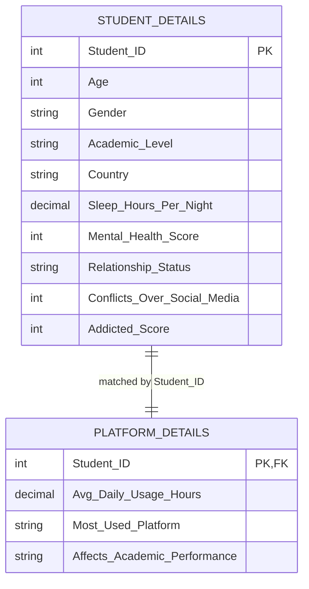

# Entity Relationship Diagram

## Relationship Details

| Parent table | Child table | Join column | Cardinality | Recommended filter direction |
|---|---|---|---|---|
| `Student Details` | `Platform Details` | `Student_ID` | One-to-one (1:1) | Single direction: Student Details → Platform Details |

`Student_ID` is unique and non-null in both tables. `Platform Details[Student_ID]` acts as the foreign key that connects each student profile to their social-media platform information.

> The Power BI model also contains a DateTable layout object, but no date field exists in the supplied source data; it is therefore omitted from this ER diagram.
